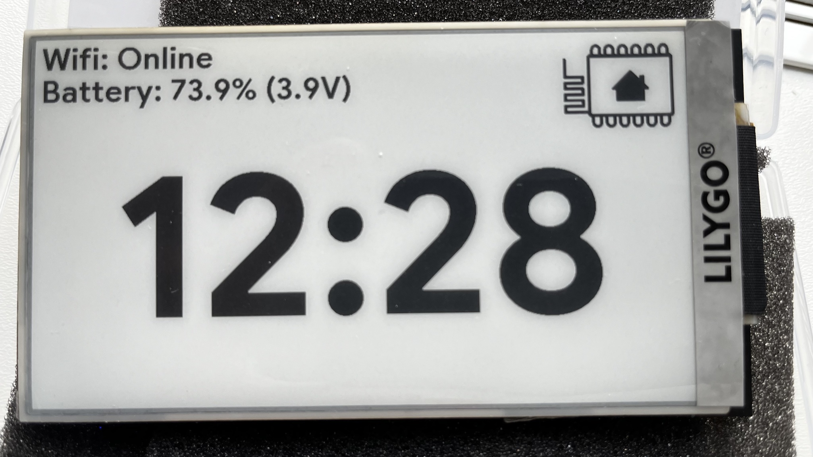

# ESPHome LilyGo T5 S3 Plus

## Requirements
These examples and documentation is based on the following versions:

* Home Assistant version `2023.12.3`
* ESPHome version `2023.12.5`

### ESPHome LilyGo T5 S3 Plus Board config
The config for the LilyGo T5 S3 Plus board is not available in ESPHome by default, but can be downloaded and imported into your config.

The original config can be found at: https://github.com/Xinyuan-LilyGO/LilyGo-EPD47/blob/master/platformio/boards/lilygo-t5-47-plus.json


## Basic Clock Example


### Installation

* Install ESPHome add-on in your Home-Assistant.
* Install `Advanced SSH & Web Terminal` or other terminal add-on to be able to navigate through the Home-Assistant filesystem.

#### Secrets config
* In the Home-Assistant menu click on ESPHome.
* In the right top click on `Secrets`

```
wifi_ssid: "Name of your wifi"
wifi_password: "wifi password"
```

#### Device config

* In the Home-Assistant menu click on ESPHome.
* Click on `New Device`
* Click on `Continue`
* Give it a name like `basic-clock`
* Select `ESP32-S3`
* Click on `Skip`
* Click on `Edit` on the new device and save the config on your computer (you will need some config values later on)
* Copy and paste the contents of [basic-clock.yaml](basic-clock.yaml) into your device.
* Replace the `REPLACE_ME` values with the values from the saved config on your computer.
* Save the config, and you are ready to flash your board with the new config.

#### Home Assistant Changes
* In the Home-Assistant menu click on Terminal.
* Run `mkdir -p /config/esphome/.esphome/basic-clock/boards`
* Run `cd /config/esphome/.esphome/basic-clock/boards`
* Run `wget https://raw.githubusercontent.com/Xinyuan-LilyGO/LilyGo-EPD47/master/platformio/boards/lilygo-t5-47-plus.json`
* Run `cd ..`
* Run `mkdir fonts`
* Run `cd fonts`
* Run `wget https://github.com/hprobotic/Google-Sans-Font/raw/master/GoogleSans-Bold.ttf`

Now you should have the following file tree:

```
/config/esphome/.esphome/
|
+ basic-clock
  |
  + fonts
    |
    + GoogleSans-Bold.ttf
  + boards
    |
    + lilygo-t5-47-plus.json
```


#### First firmware flash
We are going to use Chrome and the [ESPHome web](https://web.esphome.io/) app to flash the first firmware through USB on your remote device (desktop or laptop). 

The LilyGo does not need to be connected to the Home-Assistant server directly.

* In the Home-Assistant menu click on ESPHome.
* Click on the 3 dots next to `Logs` on your new device `basic-clock`
* Click on `Install`
* Click on `Plug into this computer`
* It will start building the firmware, wait on it and download the firmware to your computer. 
* Chrome will see the file as insecure and you need to click on `Keep` to accept the file.
* Open the web application in Chrome [ESPHome Web](https://web.esphome.io/?dashboard_install)
* Be sure your board is connected with a good working USB+C cable!
* Reset your board to accept a new firmware by holding the button `STR_100` and press the button `REST`.
* Click on `Connect` and select your device.
* Click on `Install` and select your downloaded firmware.
* When its done click on `REST` and it should boot your firmware.
* Click on `Logs` to see if its working correctly.

